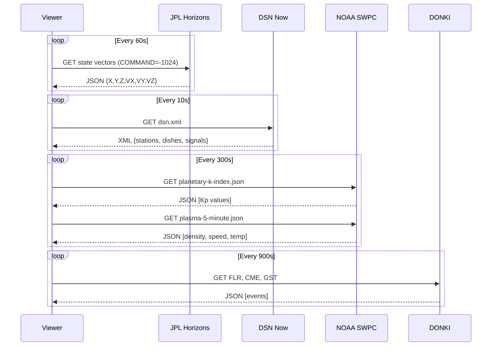

# Technical Analysis — Artemis-II Python Viewer

## Table of Contents

- [1. System Architecture](#1-system-architecture)
- [2. API Endpoints Reference](#2-api-endpoints-reference)
  - [2.1 JPL Horizons API — Spacecraft Ephemeris](#21-jpl-horizons-api--spacecraft-ephemeris)
  - [2.2 DSN Now — Deep Space Network Live Feed](#22-dsn-now--deep-space-network-live-feed)
  - [2.3 NOAA SWPC — Space Weather](#23-noaa-swpc--space-weather)
  - [2.4 NASA DONKI — Space Weather Events](#24-nasa-donki--space-weather-events)
  - [2.5 NASA OEM Ephemeris Files](#25-nasa-oem-ephemeris-files)
- [3. Data Formats and Protocols](#3-data-formats-and-protocols)
- [4. Data Flow](#4-data-flow)
- [5. Coordinate Systems and Reference Frames](#5-coordinate-systems-and-reference-frames)
- [6. Polling Strategy and Rate Limits](#6-polling-strategy-and-rate-limits)
- [7. Error Handling](#7-error-handling)
- [8. Implementation Architecture](#8-implementation-architecture)
- [9. Verified API Response Formats](#9-verified-api-response-formats)

---

## 1. System Architecture

```
+---------------------+      +-------------------+      +------------------+
|   NASA / JPL / NOAA |      |  Fetcher Threads  |      |   Rich Live      |
|   Public APIs       +----->+  (4 daemon threads)+----->+   Dashboard     |
+---------------------+      +-------------------+      +------------------+
        |                            |                          |
        |  HTTP GET (JSON/XML)       |  Frozen dataclasses      |  1 Hz render
        |  No auth required          |  via SharedState(Lock)   |  main thread
        v                            v                          v
  - Horizons API             - StateVector              - Header panel
  - DSN Now XML              - DSNData                  - Spacecraft panel
  - SWPC JSON feeds          - SpaceWeatherData         - DSN panel
  - DONKI REST API           - DONKIData                - Weather panel
                                                        - Alerts panel
```

The system follows a **poll-and-render** architecture with threading:

1. **4 fetcher daemon threads** poll each API at independent intervals
2. **Frozen dataclasses** are atomically swapped into a `SharedState` container (single `threading.Lock`)
3. **Main thread** renders a `rich.live.Live` dashboard at 1 Hz, reading from `SharedState.snapshot()`
4. **Graceful shutdown** via `threading.Event` — `Ctrl+C` signals all threads to stop

---

## 2. API Endpoints Reference

### 2.1 JPL Horizons API — Spacecraft Ephemeris

**Primary data source for Orion position and velocity.**

| Field | Value |
|-------|-------|
| Base URL | `https://ssd.jpl.nasa.gov/api/horizons.api` |
| Method | `GET` |
| Auth | None |
| Response | JSON or plain text |
| Rate Limit | Undocumented; use conservative polling (~60s) |

#### Spacecraft Lookup

```
GET https://ssd.jpl.nasa.gov/api/horizons_lookup.api?sstr=Artemis&group=sct&format=json
```

Returns spacecraft IDs. Artemis II (Orion) has:
- **SPKID**: `-1024`
- **Aliases**: "Integrity", "Orion EM-2"
- **Designation**: `2026-069A`

#### State Vectors Request

```
GET https://ssd.jpl.nasa.gov/api/horizons.api
  ?format=json
  &COMMAND='-1024'
  &OBJ_DATA='NO'
  &MAKE_EPHEM='YES'
  &EPHEM_TYPE='VECTORS'
  &CENTER='500@399'          # Earth center
  &START_TIME='2026-04-05'
  &STOP_TIME='2026-04-06'
  &STEP_SIZE='1 h'
  &OUT_UNITS='KM-S'
  &REF_SYSTEM='J2000'
  &CSV_FORMAT='YES'
```

**Response fields** (CSV within JSON `result` string):

| Column | Description | Unit |
|--------|-------------|------|
| JDTDB | Julian Date (TDB) | days |
| Calendar Date (TDB) | Human-readable timestamp | — |
| X, Y, Z | Position components | km |
| VX, VY, VZ | Velocity components | km/s |
| LT | One-way light time | s |
| RG | Range from center | km |
| RR | Range rate | km/s |

#### Moon-Centered Variant

Change `CENTER` to `'500@301'` (Moon center) to get Orion's position relative to the Moon — useful for computing lunar closest approach.

#### Observer Ephemeris (RA/Dec)

```
GET https://ssd.jpl.nasa.gov/api/horizons.api
  ?format=json
  &COMMAND='-1024'
  &EPHEM_TYPE='OBSERVER'
  &CENTER='500@399'
  &START_TIME='2026-04-05'
  &STOP_TIME='2026-04-06'
  &STEP_SIZE='1 h'
  &QUANTITIES='1,9,20,23'
```

Useful for sky position (RA/Dec), visual magnitude, and angular diameter.

---

### 2.2 DSN Now — Deep Space Network Live Feed

**Real-time view of which DSN antennas are tracking Orion.**

| Field | Value |
|-------|-------|
| Data URL | `https://eyes.nasa.gov/dsn/data/dsn.xml` |
| Config URL | `https://eyes.nasa.gov/apps/dsn-now/config.xml` |
| Method | `GET` |
| Auth | None |
| Response | XML |
| Update interval | ~5 seconds |

#### XML Structure

```xml
<dsn>
  <station name="gdscc" friendlyName="Goldstone" timeUTC="..." timeZoneOffset="...">
    <dish name="DSS14" azimuthAngle="..." elevationAngle="..." windSpeed="...">
      <downSignal spacecraft="EM2" signalType="data" dataRate="..." frequency="..." power="..."/>
      <upSignal spacecraft="EM2" signalType="data" dataRate="..." frequency="..." power="..."/>
      <target name="EM2" id="-1024" uplegRange="..." downlegRange="..." rtlt="..."/>
    </dish>
  </station>
  <!-- mdscc (Madrid), cdscc (Canberra) -->
</dsn>
```

Key data points:
- **`uplegRange` / `downlegRange`**: distance to spacecraft in km
- **`rtlt`**: round-trip light time in seconds
- **`dataRate`**: telemetry data rate in bps
- **`frequency`**: communication frequency in Hz
- **Spacecraft ID**: `EM2` maps to Artemis II / Orion

#### DSN Stations

| Code | Name | Location |
|------|------|----------|
| gdscc | Goldstone | California, USA |
| mdscc | Madrid | Spain |
| cdscc | Canberra | Australia |

---

### 2.3 NOAA SWPC — Space Weather

**Real-time space weather conditions relevant to crew safety.**

All endpoints: `GET`, no auth, JSON response.

#### Geomagnetic Activity

```
https://services.swpc.noaa.gov/products/noaa-planetary-k-index.json
https://services.swpc.noaa.gov/products/noaa-planetary-k-index-forecast.json
```

Returns an array of JSON objects (not arrays as sometimes documented). Each object has keys:
`{time_tag, Kp, a_running, station_count}`. Kp >= 5 indicates a geomagnetic storm.

> **Implementation note**: The parser must handle both dict and list formats, as the API response format may vary.

#### Solar Wind (Plasma)

```
https://services.swpc.noaa.gov/products/solar-wind/plasma-5-minute.json
https://services.swpc.noaa.gov/products/solar-wind/plasma-2-hour.json
https://services.swpc.noaa.gov/products/solar-wind/plasma-1-day.json
https://services.swpc.noaa.gov/products/solar-wind/plasma-3-day.json
https://services.swpc.noaa.gov/products/solar-wind/plasma-7-day.json
```

Fields: `[time_tag, density, speed, temperature]`

#### Solar Wind (Magnetic Field)

```
https://services.swpc.noaa.gov/products/solar-wind/mag-5-minute.json
https://services.swpc.noaa.gov/products/solar-wind/mag-2-hour.json
https://services.swpc.noaa.gov/products/solar-wind/mag-1-day.json
```

Fields: `[time_tag, bx_gsm, by_gsm, bz_gsm, lon_gsm, lat_gsm, bt]`

A strongly negative Bz (< -10 nT) combined with high solar wind speed indicates increased geomagnetic storm risk.

#### Aurora Forecast

```
https://services.swpc.noaa.gov/json/ovation_aurora_latest.json
```

#### NOAA Space Weather Scales

```
https://services.swpc.noaa.gov/products/noaa-scales.json
```

Returns current G (geomagnetic), S (solar radiation), R (radio blackout) scale levels.

---

### 2.4 NASA DONKI — Space Weather Events

**Historical and near-real-time space weather event database.**

| Field | Value |
|-------|-------|
| Base URL | `https://kauai.ccmc.gsfc.nasa.gov/DONKI/WS/get/` |
| Method | `GET` |
| Auth | None |
| Response | JSON |

#### Available Event Types

| Endpoint | Description |
|----------|-------------|
| `CME?startDate=YYYY-MM-DD&endDate=YYYY-MM-DD` | Coronal Mass Ejections |
| `CMEAnalysis?startDate=...&endDate=...&catalog=ALL` | CME trajectory analysis |
| `FLR?startDate=...&endDate=...` | Solar Flares |
| `SEP?startDate=...&endDate=...` | Solar Energetic Particles |
| `GST?startDate=...&endDate=...` | Geomagnetic Storms |
| `IPS?startDate=...&endDate=...&location=Earth` | Interplanetary Shocks |
| `MPC?startDate=...&endDate=...` | Magnetopause Crossings |
| `RBE?startDate=...&endDate=...` | Radiation Belt Enhancements |
| `HSS?startDate=...&endDate=...` | High Speed Streams |
| `WSAEnlilSimulations?startDate=...&endDate=...` | WSA-ENLIL Simulations |
| `notifications?startDate=...&endDate=...&type=all` | All Notifications |

#### Example: Recent Solar Flares

```
GET https://kauai.ccmc.gsfc.nasa.gov/DONKI/WS/get/FLR?startDate=2026-04-01&endDate=2026-04-05
```

---

### 2.5 NASA OEM Ephemeris Files

**High-resolution pre-computed trajectory (CCSDS Orbit Ephemeris Message format).**

| Field | Value |
|-------|-------|
| URL | `https://www.nasa.gov/wp-content/uploads/2026/03/artemis-ii-oem-2026-04-04-to-ei.zip` |
| Format | ZIP containing CCSDS OEM text file |
| Resolution | 4-minute intervals (2-second during maneuvers) |
| Reference | [AROW tracking page](https://www.nasa.gov/missions/artemis/artemis-2/track-nasas-artemis-ii-mission-in-real-time/) |

#### OEM Record Format

Each record contains:
```
EPOCH_UTC  X(km)  Y(km)  Z(km)  VX(km/s)  VY(km/s)  VZ(km/s)
```

Reference frame: J2000, Earth-centered (EME2000).

NASA updates this file periodically during the mission. The viewer should check for new versions and re-download when available.

---

## 3. Data Formats and Protocols

| Source | Protocol | Format | Parsing |
|--------|----------|--------|---------|
| Horizons | HTTPS GET | JSON wrapping CSV/text | Parse `result` string, extract CSV rows |
| DSN Now | HTTPS GET | XML | `xml.etree.ElementTree` or `lxml` |
| SWPC | HTTPS GET | JSON arrays | First row = headers, remaining rows = data |
| DONKI | HTTPS GET | JSON objects | Standard JSON deserialization |
| OEM | HTTPS GET | ZIP > plain text | Unzip, parse CCSDS OEM line-by-line |

---

## 4. Data Flow



---

## 5. Coordinate Systems and Reference Frames

| Frame | Used By | Description |
|-------|---------|-------------|
| J2000 (EME2000) | Horizons, OEM | Earth Mean Equator and Equinox of J2000.0 |
| ICRF | Horizons (default) | International Celestial Reference Frame (~= J2000) |
| GSM | SWPC mag data | Geocentric Solar Magnetospheric |

### Distance Computations

From Earth-centered state vectors `(X, Y, Z)`:

```
distance_from_earth = sqrt(X^2 + Y^2 + Z^2)
```

For distance from Moon, either:
- Query Horizons with `CENTER='500@301'` (Moon-centered), or
- Subtract Moon's geocentric position (query Moon with `COMMAND='301'` and same `CENTER='500@399'`)

---

## 6. Polling Strategy and Rate Limits

| API | Recommended Interval | Rationale |
|-----|---------------------|-----------|
| Horizons | 60 seconds | Position changes slowly; avoid overloading JPL |
| DSN Now | 10 seconds | Fast updates, lightweight XML |
| SWPC (Kp, plasma) | 5 minutes | Data itself updates every 5 min |
| SWPC (scales) | 5 minutes | Low-frequency summary |
| DONKI | 15 minutes | Event-level data, infrequent updates |
| OEM file | 1 hour | Static file, updated occasionally by NASA |

None of these APIs document explicit rate limits, but conservative polling is recommended. Use `If-Modified-Since` or `ETag` headers where supported to minimize bandwidth.

---

## 7. Error Handling

| Scenario | Strategy |
|----------|----------|
| API returns HTTP 5xx | Retry with exponential backoff (max 3 retries) |
| API returns HTTP 4xx | Log error, skip this cycle, continue with cached data |
| Network timeout | Use last known good data; display staleness indicator |
| Horizons returns no ephemeris | Spacecraft may be outside coverage window; fall back to OEM file |
| DSN shows no EM2 contact | Normal — DSN antennas rotate between spacecraft; display "No active link" |
| Malformed response | Log and skip; do not crash the viewer |

All fetchers should maintain a **last known good state** so the viewer remains functional during transient failures.

---

## 8. Implementation Architecture

### Module Map

```
artemis/
├── config.py              # All constants: URLs, SPKID, intervals, timeline
├── models.py              # 10 frozen dataclasses (StateVector → TrajectoryData)
├── state.py               # SharedState: Lock + 5 data slots + error dict
├── compute.py             # Pure functions: distance, speed, MET, staleness
├── trajectory_storage.py  # Incremental JSONL storage for trajectory history
├── fetchers/
│   ├── base.py            # BaseFetcher: thread loop, retry with backoff
│   ├── horizons.py        # 2 API calls/cycle (Orion + Moon), CSV-in-JSON parser
│   ├── dsn.py             # XML parser, filters for spacecraft="EM2"
│   ├── swpc.py            # 3 API calls/cycle (Kp + plasma + mag + scales)
│   └── donki.py           # 3 API calls/cycle (FLR + CME + GST, last 3 days)
├── photo_carousel.py      # Carousel management for NASA IOTD images
├── photo_viewer.py        # Photo viewer interface
├── dashboard/
│   ├── app.py             # DashboardApp: orchestrates threads + Rich Live
│   ├── layout.py          # 6-panel Layout (header/trajectory/spacecraft/dsn/weather/alerts)
│   ├── native_viewer.py   # PhotoViewerWindow - native Tkinter window
│   ├── trajectory_native_viewer.py  # TrajectoryViewerWindow - native Tkinter with 2D map + history
│   └── panels/            # Each panel: data → Rich renderable, with error fallback
│       ├── solar_map.py   # Current position map: Earth-relative, Orion in magenta
│       ├── header.py      # Mission timeline and phase
│       ├── spacecraft.py  # Orion telemetry
│       ├── dsn.py         # DSN antenna status
│       ├── weather.py     # Space weather
│       └── alerts.py      # Alerts
└── cache/                 # Cached data directory
    ├── trajectory_data/   # JSONL files with trajectory history
    └── photos/            # Cached mission photos
```

### Threading Model

```
Main Thread                     Daemon Threads
═══════════                     ══════════════
                                HorizonsFetcher  (every 60s)
Rich Live render loop ←—Lock—→  DSNFetcher       (every 10s)
(1 Hz, reads snapshot)          SWPCFetcher      (every 300s)
                                DONKIFetcher     (every 900s)
```

Each fetcher:
1. Calls `fetch_and_update()` → HTTP GET → parse → create frozen dataclass
2. Acquires lock → swaps reference in SharedState → releases lock
3. Calls `threading.Event.wait(interval)` (interruptible for clean shutdown)
4. On error: logs, stores error message in SharedState, continues next cycle

### Dependencies

Only two external packages:
- `rich>=13.0` — terminal UI (Layout, Live, Panel, Table, Text)
- `requests>=2.31` — HTTP client

Everything else is standard library (`threading`, `xml.etree.ElementTree`, `dataclasses`, `csv`, `io`, `math`, `datetime`).

### Trajectory Panel (`solar_map.py`)

The trajectory panel in the main dashboard renders the **current position only** of Orion relative to Earth.

**Reference frame**: Always Earth-centered. Orion position `(X, Y, Z)` is in the J2000 equatorial frame. Moon position updates every cycle as it moves.

**2D projection**: The 3D vector is projected onto the best-visible plane (X-Y, X-Z, or Y-Z) determined dynamically by `get_projection_axes()`.

**Rendering**:
- Earth 🌍 at center (grid center)
- Moon 🌕 at relative position
- Orion ◆ in **bright magenta**, showing current position only
- Legend bar: MET, Earth distance, Moon distance
- Footer: "Press [T] to open" — opens trajectory history viewer

**Key change from earlier**: No trajectory trail in the dashboard panel. The full history is shown in the separate Tkinter window (Press T).

### Trajectory History Viewer (`trajectory_native_viewer.py`)

Opens in a **native Tkinter window** when user presses [T]. Two-part interface:

**Top: 2D Trajectory Map**
- Displays all trajectory samples from mission start to current time
- Cyan line shows the complete trajectory path
- Grid background with axis labels
- **START** marker (green ✓) at launch position
- **CURRENT** marker (magenta ◆) at latest position
- Sampling: shows every Nth point to avoid clutter (depends on total samples)

**Bottom: Trajectory History List**
- Scrollable list of all trajectory samples
- Each entry: `TIMESTAMP | 🌍 EARTH_DISTANCE | 🌙 MOON_DISTANCE`
- Newest samples first (reversed chronological order)
- Monospace font for alignment

**Window management**: 
- If pressed again while open, brings window to front (focus) instead of creating a duplicate
- ESC key closes the window

### Photo Viewer (`native_viewer.py`)

Opens in a **native Tkinter window** when user presses [P].

**Features**:
- Display full-resolution NASA IOTD images
- Image fits to window with aspect ratio preserved
- Navigation: arrow keys (Left/Right) to cycle through carousel
- Sidebar list of all cached photos with index
- Photo metadata: title, date, source info
- Click on list item to jump to that photo

**Window management**:
- If pressed again while open, brings window to front (focus)
- ESC key closes the window
- Carousel rotates automatically based on cached images

### Data Storage

**Trajectory history** (`trajectory_storage.py`):
- Stored incrementally in `cache/trajectory_data/` as JSONL
- Each line is a complete trajectory sample: `{timestamp, orion: {x, y, z, vx, vy, vz}, moon: {x, y, z}}`
- Format is human-readable JSON Lines, sortable by timestamp
- No re-downloading of old data; only new samples appended
- Loaded on demand by trajectory viewer and storage module

**Mission photos** (`cache/photos/`):
- Downloaded NASA IOTD images cached as `.jpg` files
- Carousel metadata stored separately
- Rotates through cached images without internet once loaded

### Key Design Decisions

| Decision | Rationale |
|----------|-----------|
| Earth-relative in dashboard, full history in separate window | Main panel shows current state cleanly; details in dedicated viewer |
| Magenta for current Orion position | Matches trajectory viewer's CURRENT marker; visually distinct |
| Native Tkinter viewers instead of browser | Simpler, no dependencies, works offline, cleaner integration |
| Window focus on repeated key press | Prevents accidental duplicate windows; user experience is improved |
| 2D map only (no 3D) | 3D rendering adds complexity; 2D orthogonal projection sufficient for mission tracking |
| Incremental JSONL storage | Human-readable, can be parsed line-by-line, efficient append-only, no database needed |

### Key Design Decisions

| Decision | Rationale |
|----------|-----------|
| `threading` over `asyncio` | 4 independent polling loops; simpler to reason about; no event loop complexity |
| Frozen dataclasses | Atomic swap in SharedState; renderer always sees consistent snapshot |
| Single Lock | Minimal contention: each fetcher writes to a distinct slot; lock held only for pointer swap |
| `Event.wait(interval)` over `time.sleep()` | Allows immediate thread wakeup on shutdown |
| Separate Orion + Moon Horizons queries | Earth-centered frame for both; Moon distance = vector subtraction |
| Emoji markers over ASCII art | 🌍🌕 are universally recognizable; avoids terminal font/aspect-ratio issues with block characters |
| Moon-centred frame over inertial | Shows Orion orbiting the Moon directly; matches `docs/plans/trajectory.md` algorithm |
| Power-law compression over linear scaling | Close-approach orbit (~2,000 km) would be invisible at linear scale relative to Earth-Moon distance (~384,000 km) |

---

## 9. Verified API Response Formats

Verified against live APIs on 2026-04-05.

### Horizons State Vectors

Request with `CSV_FORMAT='YES'` returns JSON with a `result` string containing CSV data between `$$SOE` / `$$EOE` markers:

```
$$SOE
2460771.510416667, A.D. 2026-Apr-05 00:15:00.0000, -1.134E+05, -2.820E+05, -2.623E+04, ...
$$EOE
```

Fields: `JDTDB, Calendar_Date(TDB), X, Y, Z, VX, VY, VZ, LT, RG, RR`

Sample verified values (Flight Day 1):
- Orion position: X=-113,415 Y=-282,004 Z=-26,230 km
- Earth distance: ~305,000 km
- Moon distance: ~156,000 km
- Speed: ~0.94 km/s (3,386 km/h)

### SWPC Kp Index

Returns **array of dicts** (not array of arrays):
```json
[
  {"time_tag": "2026-04-04T21:00:00", "Kp": 2.33, "a_running": 9, "station_count": 8}
]
```

### SWPC Plasma / Mag

Returns **array of arrays**, first row is headers:
```json
[
  ["time_tag", "density", "speed", "temperature"],
  ["2026-04-05 00:06:00.000", "1.83", "574.7", "64711"]
]
```

### SWPC Scales

Returns **dict keyed by forecast period** (`"0"` = current):
```json
{
  "0": {
    "R": {"Scale": "0", "Text": "none"},
    "S": {"Scale": "0", "Text": "none"},
    "G": {"Scale": "0", "Text": "none"}
  }
}
```

### DONKI Events

Returns **array of objects** per event type. Example for FLR (Solar Flares):
```json
[
  {
    "flrID": "...",
    "beginTime": "2026-04-04T22:54Z",
    "peakTime": "2026-04-04T23:02Z",
    "classType": "M1.0",
    "link": "https://..."
  }
]
```

### DSN Now

Returns XML. Stations contain dishes, dishes contain targets and signals. Filter by `target[@name='EM2']` or `downSignal[@spacecraft='EM2']`. Note: EM2 may not appear if no antenna is currently tracking Orion (normal operational behavior).
